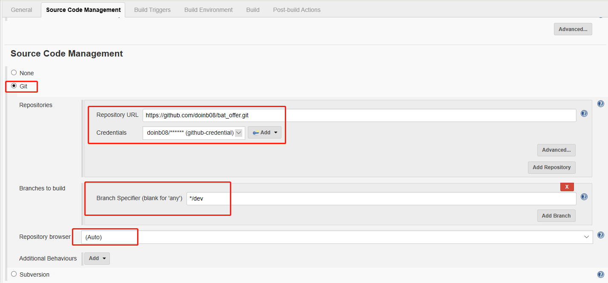
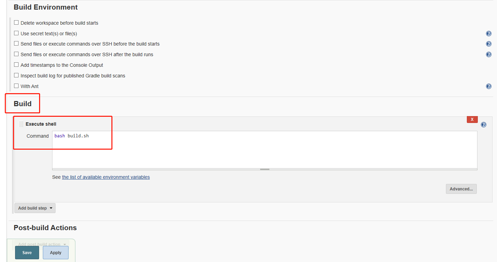

## docker构建自动化部署流水教程
本步骤用于学习Docker+GitHub+Jenkins+Maven自动化构建部署流程，从GitHub上拉取代码到自己的云服务进行部署。
准备环境：  
1. 本地Linux服务器/云服务器    
2. 服务器安装docker环境, [docker安装教程](https://blog.csdn.net/doinbb/article/details/103034608)      
3. 服务器安装mvn, 安装Java环境，mvn -v，java --version 需验证成功。   
4. 服务器安装 [Jenkins官网](https://www.jenkins.io/zh/doc/pipeline/tour/getting-started/)     
5. 代码仓库准备，你可以先fork我的代码到你的分支上，[GitHub地址](https://github.com/doinb08/bat_offer.git)  
6. 然后，把你的分支的GitHub代码仓库地址配置到Jenkins中，配置应对的分支，构建部署。  
    
    