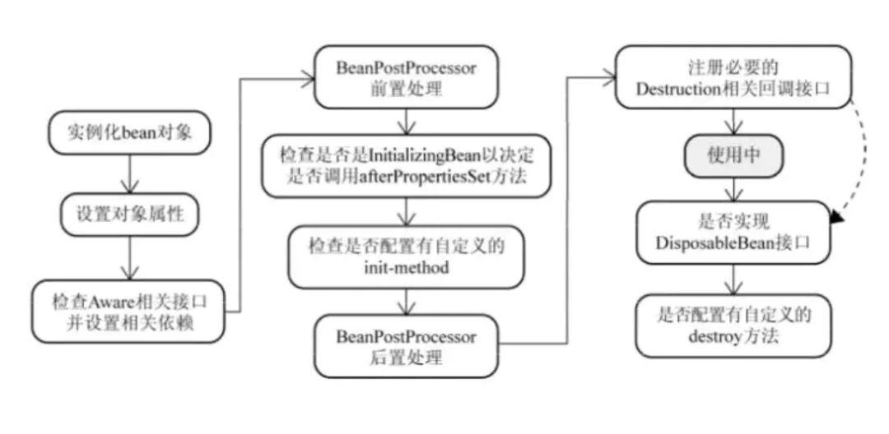

# spring AOP源码解读
[IoC官网](https://docs.spring.io/spring-framework/docs/current/spring-framework-reference/core.html)  
[Spring Github源码地址](https://github.com/spring-projects/spring-framework.git)  
如果你想加入 Spring 源码的学习，笔者的建议是从 spring-core 入手，其次是 spring-beans 和 spring-aop，  
随后是spring-context，再其次是 spring-tx 和 spring-orm，最后是 spring-web 和其他部分。

## Spring常见面试资料：
> https://juejin.im/post/5e6d993cf265da575b1bd4af  
> https://blog.csdn.net/a745233700/article/details/80959716  

## SpringMVC常见面试题总结
> https://blog.csdn.net/a745233700/article/details/80963758  

## Mybatis常见面试题总结
> https://blog.csdn.net/a745233700/article/details/80977133  

## 为什么我们要用Spring呢？
> 1. 从spring ioc角度回答：统一负责对象的创建，管理生命周期，自动维护对象依赖关系（也就是依赖注入DI）。
    依赖查找： byType byName
    依赖注入：a.构造器传参 b.方法传参 c.属性 反射 field.set(x)
    spring使用：
    bean交给spring管理
> 2. 从spring aop角度回答见下方： 什么是Spring AOP？

## 什么是Spring AOP？
与OOP(Object Oriented Programming面向对象)对比，传统的OOP开发中的代码逻辑是自上而下
在这些自上而下的过程中会产生写横切性问题。而准备横切性的问题又与我们主业务逻辑关系不大。
会散落在代码的各个地方，造成难以维护。

AOP的编程思想就是把这些散落横切性的问题和主业务逻辑进行分离，从而起到解耦的目的。

## AOP对代码的增强有几种？
有五种增强策略：
前置增强
后置增强
环绕增强
抛出增强
引入增强

BeanPostProcessor 后置处理器

底层AOP实现
DefaultAopProxyFactory createAopProxy()方法：
@Override
public AopProxy createAopProxy(AdvisedSupport config) throws AopConfigException {
    if (config.isOptimize() || config.isProxyTargetClass() || hasNoUserSuppliedProxyInterfaces(config)) {
        Class<?> targetClass = config.getTargetClass();
        if (targetClass == null) {
            throw new AopConfigException("TargetSource cannot determine target class: " +
                    "Either an interface or a target is required for proxy creation.");
        }
        if (targetClass.isInterface() || Proxy.isProxyClass(targetClass)) {
            return new JdkDynamicAopProxy(config);
        }
        return new ObjenesisCglibAopProxy(config);
    }
    else {
        return new JdkDynamicAopProxy(config);
    }
}

底层AOP是通过cglib或则java动态代理实现。
通过@EableAspactJAutoProxy注解可以指定 cglib代码或java动态代理。

那么AOP的cglib和java动态代理底层是如何实现的？
Proxy类中 Proxy.newProxyInstance(classLoader, proxiedInterfaces, this);

Proxy内部类中的ProxyClassFactory

// prefix for all proxy class names
private static final String proxyClassNamePrefix = "$Proxy";
// next number to use for generation of unique proxy class names
private static final AtomicLong nextUniqueNumber = new AtomicLong();

AOP的这个类ProxyGenerator是什么类？它是jvm的指令生成的字节码文件，

为什么java的动态代理必须是接口？
因为java是单继承多实现，且生成的代理对象继承了Proxy对象，为了不违背java设计原则，所以代理对象必须是接口；
所以java的动态代理必须是接口。

## 面试官：你说下什么是Spring？
Spring 是一种轻量级开发框架，旨在提高开发人员的开发效率以及系统的可维护性。我们一般说的Spring框架指的是Spring Framework，  
它是很多模块的集合，使用这些模块可以很方便的协助我们开发。这些模块是：核心容器、数据访问/集成、Web、AOP（面向切面编程）、工具、消息和测试模块。  
比如：Core Container中的Core组件是Spring所有组件的核心，Beans组件和Context组件是实现IOC和依赖注入的基础，AOP组件用来实现面向切面编程。  

## 面试官：使用Spring框架有什么好处呢？
框架能更让我们高效的编程以及更方便的维护我们的系统。  
1. 轻量：Spring是轻量的，相对其他框架来说。  
2. 控制反转：Spring通过控制反转实现了松散耦合，对象给出他们的依赖，而不是创建或查找依赖的对象们。  
3. 面向切面编程（AOP）：Spring支持面向切面编程，并且把业务逻辑和系统服务分开。  
4. 容器：Spring包含并管理应用中对象的生命周期和配置。  
5. MVC框架：Spring的WEB框架是个精心设计的框架，是WEB框架的一个很好的替代品。  
6. 事务管理：Spring提供一个持续的事务管理接口，提供声明式事务和编程式事务。  
7. 异常处理:Spring提供方便的API把具体技术相关的异常转化为一致的unchecked异常。  

## 面试官：你第二点提到了Spring的控制反转，能解释下吗？
首先来解释下控制反转。控制反转(Inversion Of Control，缩写为IOC)是一个重要的面向对象编程的法则来削减程序的耦合问题，也是spring框架的核心。  
应用控制反转，对象在被创建的时候，由一个调控系统内的所有对象的外界实体，将其所依赖的对象的引用，传递给它。  
也可以说，依赖被注入到对象中。  
所以，控制反转是关于一个对象如何获取他所依赖的对象的引用，这个责任的反转。  
另外，控制反转一般分为两种类型，依赖注入（Dependency Injection，简称DI）和依赖查找(Dependency Lookup)。  
依赖注入应用比较广泛。
还有几个常见的问题:
1. 谁依赖谁-当然是应用程序依赖于IOC容器。
2. 为什么需要依赖-应用程序需要IOC容器来提供对象需要的外部资源。
3. 谁注入谁-很明显是IOC容器注入应用程序某个对象，应用程序依赖的对象
4. 注入了什么-就是注入某个对象所需要的外部资源（包括对象、资源、常量数据）

## 面试官：那IOC与new对象有什么区别吗?
这就是正转与反转的区别。传统应用程序是由我们自己在对象中主动控制去直接获取依赖对象，也就是正转。而反转则是容器来帮助我们创建并注入依赖对象。  

## 面试官：好的，那IOC有什么优缺点吗？    
优点：很明显，实现了组件之间的解耦，提高程序的灵活性和可维护性。  
缺点：对象生成因为是反射编程，在效率上有些损耗。但相对于IOC提高的维护性和灵活性来说，这点损耗是微不足道的，除非某对象的生成对效率要求特别高。  

## 面试官：Spring管理这么多对象，肯定需要一个容器吧。你能说下对IOC容器的理解吗？  
首先来解释下容器：在每个框架中都有个容器的概念，所谓的容器就是将常用的服务封装起来，然后用户只需要遵循一定的规则就可以达到统一、灵活、安全、方便和快速的目的。  
然后IOC容器是具有依赖注入功能的容器，负责实例化、定位、配置应用程序中的对象以及建立这些对象间的依赖。  

## 面试官：那你能说下IOC容器是怎么工作的吗？  
首先说下两个概念。  
1. Bean的概念：
Bean就是由Spring容器初始化、装配及管理的对象，除此之外，bean就与应用程序中的其他对象没什么区别了。  
2. 元数据BeanDefinition：  
确定如何实例化Bean、管理bean之间的依赖关系以及管理bean，这就需要配置元数据，在spring中由BeanDefinition代表。  
下面说下工作原理：  
准备配置文件：配置文件中声明Bean定义也就是为Bean配置元数据。  
1. 由IOC容器进行解析元数据：IOC容器的Bean Reader读取并解析配置文件，根据定义生成BeanDefinition配置元数据对象，IOC容器根据BeanDefinition进行实例化、配置以及组装Bean。  
2. 实例化IOC容器：由客户端实例化容器，获取需要的Bean。  
举个例子：
`@Test  
public void testHelloWorld() {
 //1、读取配置文件实例化一个IoC容器
 ApplicationContext context = new ClassPathXmlApplicationContext("helloworld.xml");
 //2、从容器中获取Bean，注意此处完全“面向接口编程，而不是面向实现”
  HelloApi helloApi = context.getBean("hello", HelloApi.class);
  //3、执行业务逻辑
  helloApi.sayHello();
}`

## 面试官：那你知道BeanFactory和ApplicationContext的区别吗？
1. BeanFactory是Spring中最基础的接口。  
它负责读取bean配置文档，管理bean的加载，实例化，维护bean之间的依赖关系，负责bean的生命周期。  
2. ApplicationContext是BeanFactory的子接口，除了提供上述BeanFactory的所有功能外，还提供了更完整的框架功能：如国际化支持，资源访问，事件传递等。  
常用的获取ApplicationContext的方法：  
    2.1 FileSystemXmlApplicationContext：  从文件系统或者url指定的xml配置文件创建，参数为配置文件名或者文件名数组。  
    2.2 ClassPathXmlApplicationContext：从classpath的xml配置文件创建，可以从jar包中读取配置文件   
    2.3 WebApplicationContextUtils：  从web应用的根目录读取配置文件，需要先在web.xml中配置，可以配置监听器或者servlet来实现。    

* ApplicationContext的初始化和BeanFactory有一个重大区别：  
BeanFactory在初始化容器时，并未实例化Bean，知道第一次访问某个Bean时才实例化Bean；    
而ApplicationContext则在初始化应用上下文时就实例化所有的单例Bean，因此ApplicationContext的初始化时间会比BeanFactory稍长一些。

## [BeanFactory和FactoryBean的区别](https://mp.weixin.qq.com/s?__biz=Mzg2MjEwMjI1Mg==&mid=2247492632&idx=2&sn=8479dc3e33838eadf746bbfb97ed5911&chksm=ce0e539bf979da8df893e740d3732385fd4a351c763c560a5a534d6b5cf5978e24f03b02ea90&scene=21#wechat_redirect)
BeanFactory是接口，提供了OC容器最基本的形式，给具体的IOC容器的实现提供了规范，   
FactoryBean也是接口，为IOC容器中Bean的实现提供了更加灵活的方式，  
FactoryBean在IOC容器的基础上给Bean的实现加上了一个简单工厂模式和装饰模式(如果想了解装饰模式参考：修饰者模式(装饰者模式，Decoration)  
我们可以在getObject()方法中灵活配置。其实在Spring源码中有很多FactoryBean的实现类.  
* 区别：BeanFactory是个Factory，也就是IOC容器或对象工厂，FactoryBean是个Bean。在Spring中，所有的Bean都是由BeanFactory(也就是IOC容器)来进行管理的。  
但对FactoryBean而言，这个Bean不是简单的Bean，而是一个能生产或者修饰对象生成的工厂Bean,它的实现与设计模式中的工厂模式和修饰器模式类似。  

## 面试官：聊聊Spring的aop，你说下你对Spring aop的了解。
Aop（面向切面编程）能够将那些与业务无关，却为业务模块所共同调用的逻辑或责任（例如事务处理、日志管理、权限控制等）封装起来，  
便于减少系统的重复代码，降低模块间的耦合度，并有利于未来的扩展性和可维护性。  
举个日志处理的栗子:  
     
| 日志处理方式 | 实现方式 |
|:----:|:----:|
|硬代码编码 | 处理代码相同，代码强耦合 |
| 抽离方法，代码复用 | 手动插入实现方法，代码耦合依然强|
| AOP | 横向的功能抽离出来，形成独立模块，高内聚，低耦合|

## [面试官：那你知道Spring aop的原理吗](https://mp.weixin.qq.com/s?__biz=Mzg2MjEwMjI1Mg==&mid=2247487431&idx=1&sn=49cbc12e9db39cf223235f6291a01f7d&chksm=ce0db844f97a3152c1ad070c7ed1d67fc4d0c0aae74854eb2d6545afb1c5b9894faff5b1c116&scene=21#wechat_redirect)
Spring aop就是基于动态代理的，如果要代理的对象实现了某个接口，那么Spring aop会使用jdk proxy，去创建代理对象，而对于没有实现接口的对象，  
就无法使用jdk的动态代理，这时Spring aop会使用cglib动态代理，这时候Spring aop会使用cglib生成一个被代理对象的子类作为代理。

## 面试官：那你知道Spring Aop和AspecJ Aop有什么区别吗
Spring AOP属于运行时增强，而AspectJ是编译时增强。Spring Aop基于代理，而AspectJ基于字节码操作。  
Spring Aop已经集成了AspectJ，AspectJ应该算得上Java生态系统中最完整的AOP框架了。  
AspectJ相对于Spring Aop功能更加强大，但是Spring AOP相对来说更简单。如果我们的切面比较少，那么两者性能差异不大。  
但是，当且切面太多的话，最好选择AspectJ，它比Spring Aop快很多。

## 面试官：那你知道Spring Aop和AspecJ Aop有什么区别吗？
Spring AOP属于运行时增强，而AspectJ是编译时增强。  
Spring Aop基于代理，而AspectJ基于字节码操作。  
Spring Aop已经集成了AspectJ，AspectJ应该算得上Java生态系统中最完整的AOP框架了。  
AspectJ相对于Spring Aop功能更加强大，但是Spring AOP相对来说更简单。  
如果我们的切面比较少，那么两者性能差异不大。但是，当且切面太多的话，最好选择AspectJ，它比Spring Aop快很多。

## 面试官：你对Spring中的bean了解吗？都有哪些作用域？
Spring中的Bean有五种作用域：  
1. singleton：唯一Bean实例，Spring中的Bean默认都是单例的。  
2. prototype：每次请求都会创建一个新的bean实例。  
3. request：每次HTTP请求都会产生一个新的Bean，该Bean仅在当前HTTP request内有效。  
4. session：每次HTTP请产生一个新的Bean，该Bean仅在当前HTTP session内有效。  
5. global-session：全局session作用域，仅仅在基于portlet的web应用中才有意义，Spring5已经没有了。  

## 面试官：Spring中的Bean的生命周期你了解吗？
* 这个过程还挺复杂，去面试之前要记住。
Spring中的Bean从创建到销毁大概会经过这些：  
1. Bean容器找到配置文件中Spring Bean的定义。  
2. Bean容器利用Java反射机制创建一个Bean的实例。  
3. 如果涉及一些属性值，利用set()方法设置一些属性值。  
4. 如果Bean实现了BeanNameAware接口，调用setBeanName（）方法，传入Bean的名称。  
5. 如果Bean实现了BeanClassLoaderAware接口，调用setBeanClassLoader（）方法，传入ClassLoader对象的实例。  
6. 如果Bean实现了BeanFactoryAware接口，调用setBeanClassLoader()方法，传入ClassLoader对象的实例。  
7. 与上面类似，如果实现了其他*.Aware接口，就调用相应的方法。  
8. 如果有和加载这个Bean的Spring容器相关的BeaPostProcessor对象，执行postProcessBeforeInitialization（）方法。  
9. 如果Bean实现了InitializingBean接口，执行afterPropertiesSet（）方法。  
10. 如果Bean在配置文件中的定义包含init-method属性，执行指定的方法。  
11. 如果有和加载这个 Bean的 Spring 容器相关的 BeanPostProcessor 对象，执行postProcessAfterInitialization() 方法。  
12. 当要销毁Bean的时候，如果 Bean 实现了 DisposableBean 接口，执行 destroy() 方法。  
13. 当要销毁 Bean 的时候，如果 Bean 在配置文件中的定义包含 destroy-method 属性，执行指定的方法。  

## 面试官:将一个类声明为Spring的Bean的注解有哪些你知道吗？
一般用@Autowried注解自动装配Bean，要想把类识别为可用于自动装配的Bean，采用以下注解可以实现：  
@Component：通用的注解，可标注任意类为spring组件。  
如果一个Bean不知道属于哪个层，可以使用@Component注解标注。  
@Repository：对应持久层即Dao层，主要用于数据库的操作。  
@Service：对应服务层，主要涉及一些复杂的逻辑。  
@Controller：对应Spring MVC控制层，主要用于接收用户请求并调用Service层返回数据给前端页面。  

## 面试官：那@Component和@Bean有什么区别呢？
总结下：
1. 作用对象不同：@Component作用于类，@Bean作用于方法。  
2. @Component通常是通过类路径扫描来自动侦测以及自动装配到Spring容器中（使用@ComponentScan注解定义要扫描的路径从中找出识别了需要装配的类自动装配到spring的Bean容器中）。  
@Bean注解通常是在标有该注解的方法中定义产生这个bean，@Bean告诉Spring这是某个类的实例，当我需要用它的时候还给我。  
3. @Bean注解比@Component注解的自定义性更强，而且很多地方只能通过@Bean注解来注册Bean，比如第三方库中的类。  

## [原文章转载于](https://mp.weixin.qq.com/s?__biz=Mzg2MjEwMjI1Mg==&mid=2247492650&idx=1&sn=1f1fcba0db35b3803f7af4cffa90015a&chksm=ce0e53a9f979dabf9f42435d6ab47cc02b3e94c0c5d310f8c269159d42dc3ea4fb460add8573&mpshare=1&scene=1&srcid=&sharer_sharetime=1586696379661&sharer_shareid=d023c1ba65577277011913eb22c1166d&key=2be5a50c0e9f27d54b5e9ab8a26a0c4b5567a71eb3a3ab232be439ff5725225f553188945f3c548a449b81aba34c541d5bb98b4ebc20bf0871f94d3b38462bf9d51d9873660ec3e81a8f2ad975b517f9&ascene=1&uin=MTY0MDU0NzU4MQ%3D%3D&devicetype=Windows+7&version=62080079&lang=zh_CN&exportkey=AyV0JN%2BhlP%2BFhWpX9%2Bv2P8o%3D&pass_ticket=9fGATeUg1WFD0O2KHsj9q%2FO7Cx72GPaNn1IEOFVn0YHx2A8Ragq1qYWRYOO5CQgR)

